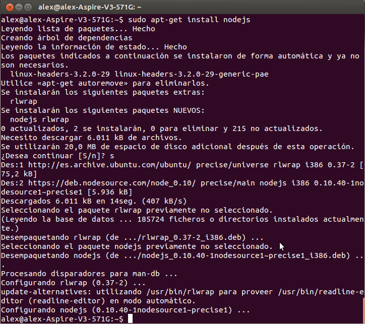
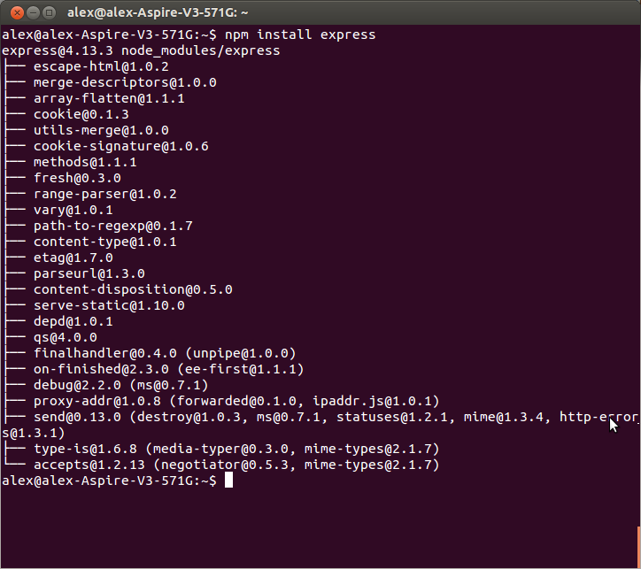
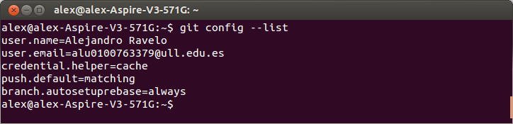
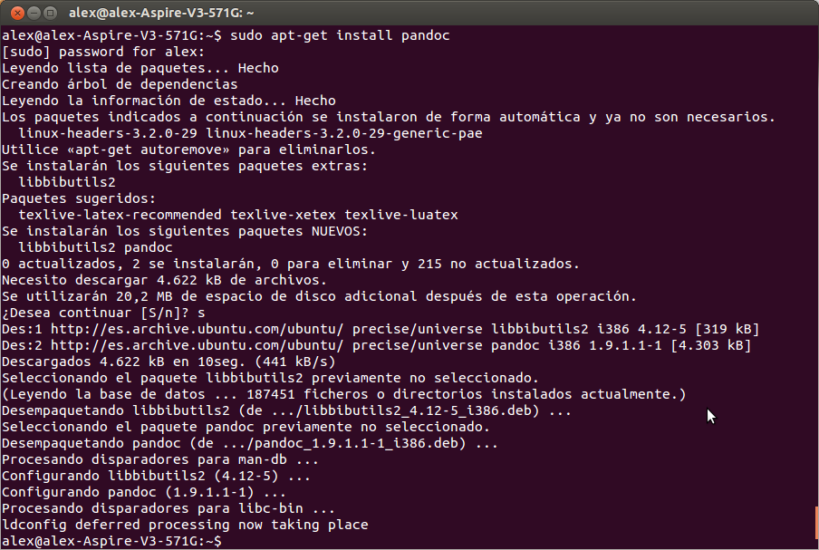

Sistemas y Tecnologías Webs
===================
Tarea inicial para la asignatura de sistemas y tecnologías web del grado de ingeniería informática de la Universidad de La Laguna.

Autor: Alejandro Ravelo Moreno
Sistema Operativo: Linux

node.JS
-------------

La primera tarea consiste en instalar node.JS y express.

Para empezar instalaremos node.JS con el comando ***apt-get install nodejs***.

> **Nota:**

> Es probable que previamente a escribir dicho comando en la terminal deba ejecutar el siguiente comando: ***curl -sL https://deb.nodesource.com/setup | sudo bash -***

Para instalar express escribimos en la consola lo siguiente: ***npm install express***.

Git
-------------

La segunda de las tareas es la instalación y configuración de **git**.

Para ello seguiremos los siguientes pasos:

 - Instalación: ***apt-get install git***.
 - Nombre de usuario: ***git config --global user.name "Nombre Apellido"***.
 - Correo electrónico: ***git config --global user.email "correo@ejemplo.es***"
 - Para que no sea necesario introducir la contraseña cada vez que se hace una actualización: ***git config --global credential.helper cache*** .
 - Todos los cambios se empujan siempre al repositorio git: ***git config --global push.default "matching"***.
 - Evitar "commits" innecesarios: ***git config --global branch.autosetuprebase always***.

Pandoc
-------------
La siguiente tarea a realizar es instalar un traductor que sea capaz de traducir nuestro documento de Markdown a HTML. El que he instalado yo ha sido **pandoc** y lo he hecho escribiendo el siguiente comando en la consola: ***apt-get install pandoc***.

Otras Tareas
-------------
 - Tanto la creación de la cuenta en GitHub como la de Cloud9, así como la vinculación de las mismas entre sí no aparecen en el tutorial ya que dichas acciones ya las había realizado con anterioridad a que esta tarea inicial fuese marcada.
 - La instalación de GitHubApp no se ha realizado ya que se ha usado Linux en todo momento.
 - No se ha instalado Atom ya que dispongo del editor SublimeText.
